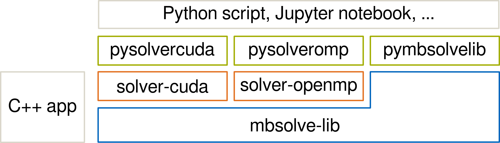

# mbsolve
An open-source solver tool for the Maxwell-Bloch equations.

Overview
--------------------

The project consists of the following components:

- mbsolve-lib: Contains the common base classes for solvers and writers (which are subsequently derived and implemented in the other subprojects). As the names suggest, the solver class is responsible for solving the Maxwell-Bloch equations while the writer class writes the results to a file of the respective format. It also provides classes to describe a device setup (materials, dimensions, ...) and a simulation scenario (simulation settings, sources, ...).

- mbsolve-tool: Is a C++ test application that solves the problem from Ziolkowski, 1995 [1].

- solver-cuda: Uses NVIDIA's CUDA framework to efficiently solve the equation system on graphics processing units (GPUs). Different solvers are implemented in this subproject.

- solver-generic: Is a no-op test solver for testing purposes only. May be discarded in future.

- solver-openmp: Uses the OpenMP standard to efficiently solve the equation system on multi-core CPUs or Intel's Xeon Phi coprocessor using the offloading technique.

- tools: Various scripts in different scripting languages.

- writer-matlab: Writes the results into the MATLAB file format.

All libraries feature a Python interface and can be used conveniently from Python scripts, Jupyter notebooks etc. See tools/python for examples.

Build instructions
--------------------
The project is built using the CMake build system. The typical commands under Linux are

    $ cd mbsolve
    $ mkdir build
    $ cd build
    $ cmake -DCMAKE_BUILD_TYPE=RelWithDebInfo ..
    $ make
    $ ./mbsolve [--options]

Usually, the build type is set to release with debug information, which enables debugging but features the optimization necessary for reasonable performance.

By default, all components are included in the build. In order to disable a component (e.g. the MATLAB writer), an extra option has to be passed to CMake:

    $ cmake -DWITH_MATLAB=OFF -DCMAKE_BUILD_TYPE=RelWithDebInfo ..

The project has been successfully compiled with the GNU compiler collection (gcc) and the Intel compiler (icc). gcc is used as default, the Intel compiler may be used with the following command:

    $ CC=path_to_intel/icc CXX=path_to_intel/icpc cmake -DWITH_CUDA=OFF \
      -DCMAKE_BUILD_TYPE=RelWithDebInfo ..

Note that CUDA does not support all versions of the Intel compiler, hence the CUDA support is disabled.

The target architecture may be set using the ARCH option. By default, compiler optimizations suitable for the host machine are applied. However, when building for another machine the architecture can be set with e.g.

    $ cmake -DARCH=AVX2 -DCMAKE_BUILD_TYPE=RelWithDebInfo ..

In particular, building for Intel's Xeon Phi coprocessor is enabled with

    $ CC=path_to_intel/icc CXX=path_to_intel/icpc cmake -DWITH_CUDA=OFF \
      -DARCH=PHI -DCMAKE_BUILD_TYPE=RelWithDebInfo ..

The Doxygen documentation can be build with

    $ make doc

Dependencies
--------------------
If the required dependencies are not met, the components may be disabled by the build system. The dependencies are listed in the following with the minimum version given in brackets:

- Python (2.7) and SWIG (2.0) for Python support
- MATLAB (any recent version) for matlab-writer
- CUDA (7.0) for solver-cuda
- OpenMP (any recent version) for solver-openmp
- Boost (any recent version) for mbsolve-tool
- Doxygen (any recent version) for the documentation
- Eigen library (3.0) (currently, it is required for solver-openmp. This will change in near future.)

References
--------------------
[1] https://journals.aps.org/pra/abstract/10.1103/PhysRevA.52.3082
